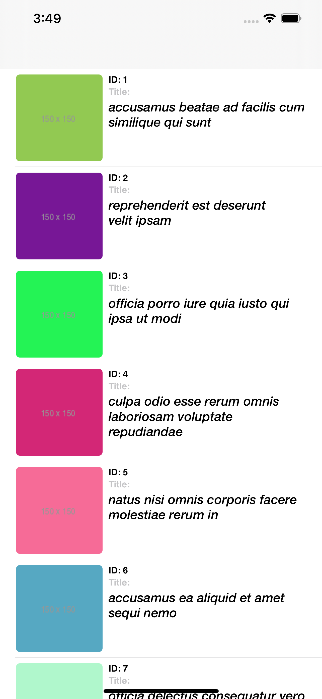
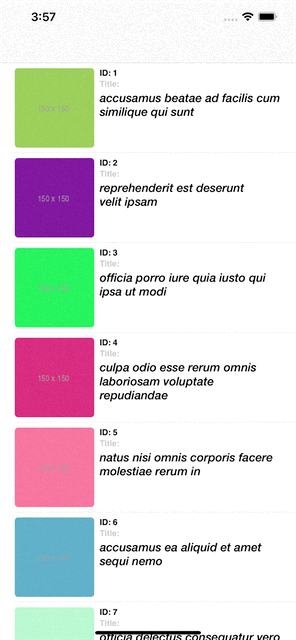

# ExtraSpaceTest
A repository for the coding challenge assigned by ExtraSpaceStorage

#iOS Coding exercise issued by ExtraSpaceStorage. 

Thank you so much for checking out the project that I made for this coding exercise! I had a lot of fun putting this together and adding my own little bit of spice in areas that I felt could use it. 

## Here is a what I built, with screenshots
- A nice looking tableView that fetches albums from https://jsonplaceholder.typicode.com/photos/ (10 at a time).
- All images are cached so we are not making unnecessary network calls.

- Clicking on an album will navigate to a detail view.

- Pulling from the top of the tableview downward exposes a pull-to-refresh.

- Scrolling to the bottom of the table will fetch another 10 albums.

